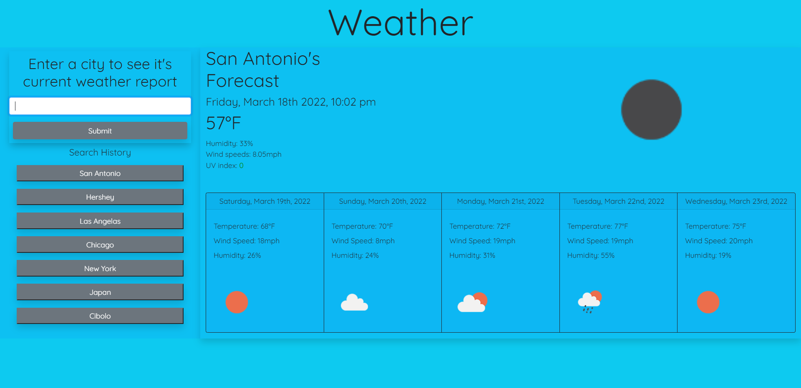

# Weather-Checker
This weather checker application uses a mixture of openweathermap.org, moment.js, and moment.tz to display the current weather data and a future 5-day forecast. All that it requires is the name of the desired city to search for the weather data. The application will locally save up to 10 searched cities and display them to the user. The user can select these cities to check the weather without having to type the name of said city into the search bar. 
> https://archiedonaho.github.io/Weather-Checker/

